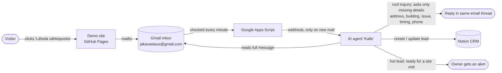

# Keravan Kattoremontit Oy (demo)

Tongue-in-cheek demo site for a **fictional** roofing company, built to showcase *Pikavastaus* – an email speed-to-lead bot that answers customer inquiries within minutes, 24/7.

Try it: send an email about your roof to **pikavastaus@gmail.com** and see how fast "Kalle" replies.

Live: https://aroharri.github.io/keravan-kattoremontit/

## How it works

1. The visitor emails the demo inbox from the site.
2. A small Google Apps Script checks the inbox every minute and calls a webhook only when new mail has arrived.
3. The AI agent fetches the full message and decides whether it is a roof inquiry, a question about the bot itself, or unclear.
4. For a roof inquiry it replies in Finnish within minutes, asking only for the details still missing, so the company can propose an inspection visit. It never quotes prices or promises same-day visits.
5. Every lead is stored in a Notion CRM, matched by email so returning senders are not asked the same things twice. Hot leads trigger an alert to the owner.

Keravan Kattoremontit Oy, its people, places and testimonials are made up. Made by Harriaro.
